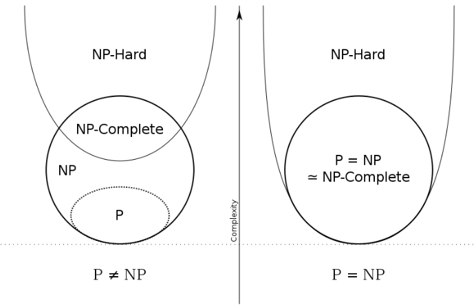
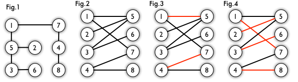
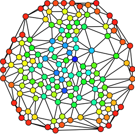
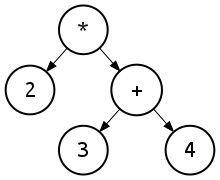

# 基本概念解析

### P, NP, NP-Complete, NP-Hard问题

*标签：算法复杂度*

P：polynomial-time，指有多项式时间解的问题

NP：non-deterministic polynomial-time，非确定性多项式时间，指不确定是否能在多项式时间内得到解

NP-Complete：还没有找到多项式时间解，但是可以在多项式时间内被验证（得到一个答案，确定它是不是一个解）的问题

NP-Hard：还没有找到多项式时间解，也不确定能不能再多项式时间内被验证的问题

### Jaccard相似度

*标签：统计学*

$$J(A,B)=\frac{|A\cap B|}{|A\cup B|}$$

例如集合 $A=\{s_1,s_2,s_3,s_4,s_5\}$ 和 $B=\{s_1,s_5,s_6,s_7\}$ 的 Jaccard 相似度：

$$J(A,B)=\frac{|A\cap B|}{|A\cup B|}=\frac{\{s_1,s_5\}}{\{s_1,s_2,s_3,s_4,s_5,s_6,s_7\}}=\frac{2}{7}$$

### MinHash

*标签：统计学；哈希算法*

当两个集合很大时，计算Jaccard距离会很耗资源，若从集合A和B的合集中随机抽取一个元素X，那么X既属于A又属于B的概率是 $\frac{|A\cap B|}{|A\cup B|}$ ，即Jaccard相似度

基于这一原理进行如下操作：首先找一个具有很好的均匀性的随机映射hash函数，对各自集合的每一个元素作哈希运算得到哈希值集合，并在各自哈希值集合里找出最小哈希值，记为 $h_{min}(A)$ 和 $h_{min}(B)$ ，称为最小哈希操作。由于随机的等概率性，那么 $h_{min}(A)$ 和 $h_{min}(B)$ 相等的概率等于 $\frac{|A\cap B|}{|A\cup B|}$ 。

从另一角度解释：选取一个哈希函数进行最小哈希操作相当于选取集合A和B合集中的一个元素的选取，由于随机性，这个最小哈希值对应的元素属于两个集合的交集的概率即是 Jaccard 相似度。

假如我们使用k个不同的hash函数，其中k是固定的整数，使用这k个函数对这两个集合进行最小哈希操作，记y是使得 $h_{min}(A)$ 和 $h_{min}(B)$ 相等的哈希函数个数，那么 $\frac{y}{k}$ 可以作为集合A和B的 Jaccard 相似度的估计。且此估计是无偏估计，而且可以通过增加k来减少估计方差。

但是计算多个哈希函数的代价太高，因此另一种实现方法是仅使用单一的哈希函选出其中的多个值来估计。例如对集合A和B使用一个哈希函数得到各自m个最小哈希值作为各自的特征集合，那么他们特征集合的Jaccard相似度可以作为原两个集合间的Jaccard相似度的估计。

### 皮尔逊积矩相关系数（Pearson product-moment correlation coefficient）

*标签：统计学*

两个变量之间的皮尔逊相关系数定义为两个变量之间的协方差和标准差的商：

$$\rho_{X,Y}=\frac{\mathrm{cov}(X,Y)}{\sigma_X \sigma_Y}=\frac{\mathrm{E}[(X-\mu_X)(Y-\mu_Y)]}{\sigma_X \sigma_Y}$$

### 平均倒数排名（Mean Reciprocal Rank，MRR）

*标签：统计学*、

评价搜索算法的通用评价指标，设搜索请求序列为 $Q$ ，对于第 $i$ 个搜索请求，正确结果在搜索结果中的排位为 $\mathrm{rank_i}$ ，则

$$\displaystyle\mathrm{MRR}=\frac{1}{|Q|}\sum_{i=1}^{|Q|}\frac{1}{\mathrm{rank_i}}$$ 

例：

| 请求  | 搜索结果             | 正确结果 | 排名 | 倒数排名 |
| ----- | -------------------- | -------- | ---- | -------- |
| cat   | catten, cati, cats   | cats     | 3    | 1/3      |
| torus | torii, tori, toruses | tori     | 2    | 1/2      |
| virus | viruses, virii, viri | viruses  | 1    | 1        |

$$\mathrm{MRR}= (1/3 + 1/2 + 1)/3 = 11/18 \approx 0.61$$

### 二分图

*标签：图论*

如果图中点可以被分为两组，并且使得所有边都跨越组的边界，则这就是一个二分图。

准确地说：把一个图的顶点划分为两个不相交集 $U$ 和 $V$ ，使得每一条边都分别连接 $U$ 、 $V$ 中的顶点。如果存在这样的划分，则此图为一个二分图。

图 1 是一个二分图。为了清晰，可以转化为图 2 的形式。

**匹配**：在图论中，一个「匹配」（matching）是一个边的集合，其中任意两条边都没有公共顶点。例如，图 3、图 4 中红色的边就是图 2 的匹配。

**最大匹配**：一个图所有匹配中，所含匹配边数最多的匹配，称为这个图的最大匹配。图 4 是一个最大匹配，它包含 4 条匹配边。

**完美匹配**：如果一个图的某个匹配中，所有的顶点都是匹配点，那么它就是一个完美匹配。图 4 是一个完美匹配。显然，完美匹配一定是最大匹配（完美匹配的任何一个点都已经匹配，添加一条新的匹配边一定会与已有的匹配边冲突）。但并非每个图都存在完美匹配。

### 介数中心性

*标签：图论；网络理论*

全连接网络图，其中任意两个节点均至少存在一个最短路径，每个节点的介数中心性即为这些最短路径穿过该节点的次数。

节点 $v$ 的介数中心性可表达为以下公式：

$$g(v)=\sum_{s\ne v \ne t} \frac{\sigma_{st}(v)}{\sigma_{st}}$$

其中 $\sigma_{st}$ 是节点 $s$ 到节点 $t$ 的最短路径的数量，而 $\sigma_{st}(v)$ 是这些路径经过 $v$ 的次数。

下图中，每个点的介数中心性从数值最低（红色）到最高（蓝色）着色。

### S-expression

*标签：计算机编程*

Lisp语言源码的书写形式，通常使用二叉树来实现S-expression。

`a = b + c` 的S-expression为 `(= a (+ b c))` 。

 S-expression `(* 2 (+ 3 4))` 的二叉树表示如下图所示。

