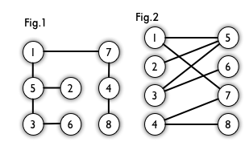

# 基本概念解析

### 二分图

*标签：图论*

如果图中点可以被分为两组，并且使得所有边都跨越组的边界，则这就是一个二分图。

准确地说：把一个图的顶点划分为两个不相交集 $U$ 和 $V$ ，使得每一条边都分别连接 $U$ 、 $V$ 中的顶点。如果存在这样的划分，则此图为一个二分图。

图 1 是一个二分图。为了清晰，可以转化为图 2 的形式。

### 介数中心性

*标签：图论；网络理论*

全连接网络图，其中任意两个节点均至少存在一个最短路径，每个节点的介数中心性即为这些最短路径穿过该节点的次数。

节点 $v$ 的介数中心性可表达为以下公式：

$$g(v)=\sum_{s\ne v \ne t} \frac{\sigma_{st}(v)}{\sigma_{st}}$$

其中 $\sigma_{st}$ 是节点 $s$ 到节点 $t$ 的最短路径的数量，而 $\sigma_{st}(v)$ 是这些路径经过 $v$ 的次数。

下图中，每个点的介数中心性从数值最低（红色）到最高（蓝色）着色。

