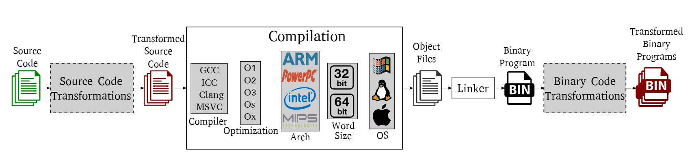
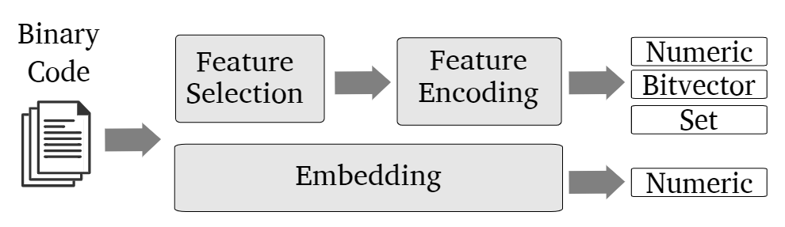

# A Survey of Binary Code Similarity

## 基本概念

### 编译流程

下图为广义编译流程，在基本编译流程上增加了源代码之间/二进制之间的转义（混淆）

二进制代码相似度分析的难点主要在于归并图中灰色部分所带来的“程序异构性”

### 二进制代码相似度检测应用场景

- bug搜索：在检索范围内确定与已知bug相似的程序片段。*变种：跨架构bug搜索*
- 恶意软件检测：寻找与已知恶意软件同一家族的恶意软件
- 恶意软件聚类：将相似的恶意软件聚类为簇
- 恶意软件族谱生成：已知属于同一家族的恶意软件，构建此家族恶意软件的演变过程
- 补丁生成与分析：通过比较分析同一软件不同版本间的差异，确定补丁内容。*下游任务：可进一步用于后续补丁分析/迁移等*
- 代码窃取检测：通过相似度分析，判断是否存在代码抄袭/许可证滥用等

## 二进制代码相似度分析概述

### 句法相似度分析

分析二进制表示（指令序列）的相似度。常用做法：提取指令序列-序列标准化-分析指令序列相似度

滑动窗口：获取定长指令序列的常见方法，使用时需考虑窗口大小和步长。当步长为1时，窗口大小为n的滑动窗口被称为n-gram

相似度计算方法：哈希、嵌入、对齐（对齐两段指令序列，计算差异值）

### 语法相似度分析

分析两段二进制程序是否有相似的运行效果，常用方法如下：

- 指令分类（instruction classification）：将指令按照功能分类，使用功能分类的组合来表示一个基本块的行为特征

- 输入输出对（input-output pairs）：直观上认为具有相同输入输出的代码片段在功能上等价。因此，此类方法仅关注代码执行完毕后的最终状态，给予代码片段多种不同的输入，观测各代码片段的输出是否完全相同

- 符号式（symbolic formula）：将汇编指令转化为符号式，利用符号式分析相似度

  例：`add %eax,%ebx --> EBX2 = EAX + EBX1`  

  符号式分析方法：

  1. 定理证明器：使用定理证明器证明两个符号式等价。*缺陷：只支持一对一分析，在一对多任务上耗时较长*

  2. 语义哈希：在标准化和化简后，判断符号式的哈希是否相同
  3. 图距离：将符号式看作树，通过计算图/树之间的编辑距离判断相似度

### 结构相似度分析

分析二进制程序图表示之间的相似度。其分析粒度介于句法相似度与语法相似度之间。

常见的图表示：控制流图（control flow graph，CFG）、过程间控制流图（inter-procedural control flow graph，ICFG）、调用图（callgraph，CG）

常用方法：

- 同构（子）图分析：直接判断两个图是否为同构图，算法复杂性较高。一些改良算法如下：
  1. 贪心算法：首先确认一组相同节点，通过不断分析邻居阶段扩张匹配的范围
  2. 回溯法：当配对效果不好或需要修复错误配对时，回溯分析问题
- “优化”方法：将相似度分析问题转化为优化问题。设置代价函数，计算两个图之间的最小代价
- k-子图匹配：将图拆分为子图，每个子图至多有k个相连的节点。为每个子图生成指纹，将具有最多子图匹配的两个图视为相似
- 路径相似度：从控制流图中提取一组执行路径，通过分析执行路径的相似度推导二进制程序相似度
- 图嵌入：为每个图生成一个特征向量，比较特征向量之间的相似度

### 基于特征的相似度分析

从二进制程序中提取特征向量或一组特征，相似的二进制程序会具有相似的特征。通过计算特征间的相似度指标（Jaccard指数、点积、欧式距离、余弦距离等）判断相似程度

特征提取的两种方式：

- 特征选择-特征编码
- 图嵌入

### 哈希算法

哈希：将任意大小的数据映射为固定大小的一种函数。

二进制代码相似度分析中常用的哈希算法：

- 密码学哈希：用于定位完全一致的输入（输入相差一点可能导致哈希值有很大差异）
- 局部敏感哈希：对于相似的输入会有相似的哈希值
- 可执行文件哈希：输入为可执行文件，哈希过程只对文件中的一部分进行（如可执行文件头部的部分内容等）。其目标在于为同一恶意软件的不同变种输出相同的哈希值

### 跨架构相似度分析

主要通过以下两种手段：

- 将不同架构的二进制程序转化为架构无关的中间表示
- 使用基于特征的相似度分析方法

### 标准化

去除具有相似功能汇编指令之间的句法差异，合并为相同的形式

- 移除操作数：只保留操作码（助记符），删除操作数

- 操作数标准化：将操作数替换为更广义的形式。例：寄存器：REG；内存：MEM；立即数：IMM

  `add %ecx,%edx --> add REG,REG` 

- 操作码（助记符）标准化：使用同一符号表示多个助记符

### 难点及未来研究方向

- 分析小型二进制片段

  许多二进制代码相似度分析方法在考虑基本块时设置了块中指令数量的最小下限（指令数小于下限的基本块不考虑）

  难点：

  - 小型二进制片段可能只包含一个基本块，无法从结构角度进行分析

  - 具有不同语义行为的基本块可能有完全相同的语法信息

- 源代码-二进制相似度分析

- 数据相似度分析

  有时不同版本程序间的差异仅仅体现在数据的不同，如改变了机器学习分类器的参数

  数据结构隐含部分函数功能信息

- 语义关系

  定位具有相关性的一些函数，如加密函数与解密函数

- 抗混淆
