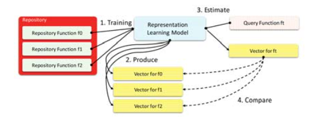
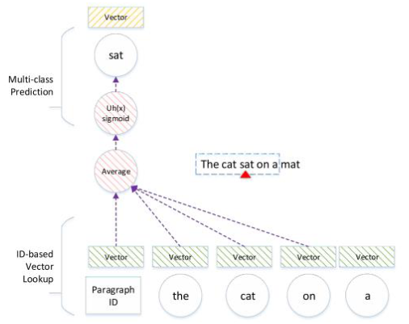
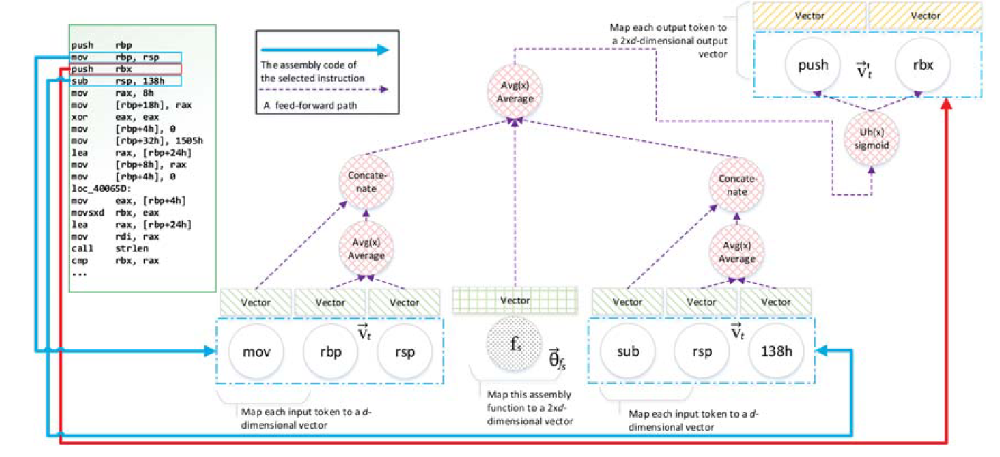

# Asm2Vec

| Target（目标）     | 第四类克隆（语义相似）检测                                   |
| :----------------- | :----------------------------------------------------------- |
| Input（输入）      | 二进制程序                                                   |
| Process（处理）    | 1. 使用边覆盖率和随机游走策略构建序列，训练asm2vec嵌入模型 2. 使用模型将函数转化为嵌入向量 3. 计算被搜索函数的嵌入向量 4. 通过比较嵌入向量获取相近函数列表 |
| Output（输出）     | 与输入函数相近的函数的列表                                   |
| Problem（问题）    | 解决的问题： 1. 现有方法较少考虑二进制程序的语义信息 2. 基于图结构的方法难以应对混淆 |
| Condition（条件）  | 所有函数为同一指令架构                                       |
| Difficulty（难点） | 从具有差异的汇编代码中提取有价值的语义信息                   |
| Level（水平）      | S&P2019                                                      |

## 算法原理

### 算法原理图

### 嵌入模型

#### PV-DM模型

论文使用的嵌入模型基于PV-DM模型实现，PV-DM模型是对原始word2vec模型的扩展。

模型使用滑动窗口遍历整个段落，使用段落编号和滑动窗口中单词编号结合生成嵌入向量

 

记语料库为 $T$ ，段落为 $p$ ，语句为 $s$ ，单词为 $w$ ，则模型希望最大化下述log概率：

$$\displaystyle \sum_p^T\sum_s^p\sum_{t=k}^{|s|-k}log\mathrm{P}(w_t|p,w_{t-k},\dots,w_{t+k})$$

#### Asm2Vec模型

该模型将每个函数映射为一个向量 $\overrightarrow{\theta}_{f_s}\in\mathbb{R}^{2\times d}$ ，其中 $d$ 为用户选定的参数。

算法将函数库中的每个函数都视作由多个句子 $\mathcal{S}$ 组成（句子的前后顺序随机），每个句子由一系列指令 $\mathcal{I}$ 构成，每个指令由多个操作码 $\mathcal{A}$ 和一个操作数 $\mathcal{P}$ 组成

将每一行指令中的操作码和操作数都视为token，映射为嵌入向量 $\overrightarrow{v}_t\in\mathbb{R}^d$ ；此外，将指令映射为另一个用于预测的向量 $\overrightarrow{v'}_t\in\mathbb{R}^{2\times d}$  

每次考虑前后共三条指令，模型希望最大化下述log概率：

$$\displaystyle \sum_{f_s}^{RP}\sum_{seq_i}^{\mathcal{S}(f_s)}\sum_{in_j}^{\mathcal{I}(seq_i)}\sum_{t_c}^{\mathcal{T}(in_j)}log\mathrm{P}(t_c|f_s,in_{j-1},in_{j+1})$$

建模某个指令需要考虑前后两条指令的信息，前后指令信息表示为操作码嵌入拼接上操作数嵌入的均值，具体计算方式为：

$$\delta(in_j,f_s)=\frac{1}{3}(\overrightarrow{\theta}_{f_s}+\mathcal{CT}(in_{j-1})+\mathcal{CT}(in_{j+1}))$$

$$\mathcal{CT}(in)=\overrightarrow{v}_{p(in)}||\frac{1}{|\mathcal{A}(in)|}\displaystyle \sum_t^{\mathcal{A(in)}}\overrightarrow{v}_{t_b}$$

由此，log概率中的 $\mathrm{P}(t_c|f_s,in_{j-1},in_{j+1})$ 可被写为 $\mathrm{P}(t_c|\delta(in_j,f_s))$ 

进一步地：

$$\mathrm{P}(t_c|\delta(in_j,f_s))&=&\mathrm{P}(\overrightarrow{v'}_{t_c}|\delta(in_j,f_s))\\&=&\frac{f(\overrightarrow{v'}_{t_d},\delta(in_j,f_s))}{\sum_d^Df(\overrightarrow{v'}_{t_c},\delta(in_j,f_s))}\\f(\overrightarrow{v'}_{t_c},\delta(in_j,f_s))&=&Uh((\overrightarrow{v'}_{t_c})^T\times\delta(in_j,f_s))$$

其中 $Uh$ 表示对向量中的每个值做sigmod变换。

遍历整个单词空间 $D$ 的计算复杂度太高，使用 $k$ 个样本采样来代替，于是log概率可以写为：

$$log\ \mathrm{P}(t_c|\delta(in_j,f_s))\approx log\ f(\overrightarrow{v'}_{t_c},\delta(in_j,f_s))+\displaystyle \sum_{i=1}^k\mathbb{E}_{t_d\sim P_n(t_c)}(log\ f(-1\times \overrightarrow{v'}_{t_d},\delta(in_j,f_s)))$$

其中 $d\ne c$ ，随后使用梯度下降法即可优化嵌入向量生成

### 汇编函数建模

汇编函数与文本段落不同，不能直接用于嵌入。

#### 被调函数扩展

造成控制流图差异的一大原因是优化过程中的函数内联。

本文参考BinGo的方法，计算 $\alpha(f_c)=outdegree(f_c)/(outdegree(f_c)+indegree(f_c))$ ，当超过阈值0.01时主动内联调用的函数

为了避免内联导致原函数更接近被内联的函数，计算下述指标 $\delta(f_s,f_c)=length(f_c)/length(f_s)$ ，仅内联小于0.6或短于10个指令的函数

#### 边覆盖率

对控制流图中的边做随机采样，最终确保所有边都被采样到。将采样后边对应的汇编代码合并为一个新的序列。

#### 随机游走

使用随机游走策略在控制流图中选择序列。在这一过程中，包含多个分支的关键节点更容易被覆盖到。

## 实验设计

1. 对比实验，搜索不同优化选项（O0和O3）下的二进制文件
2. 对比实验，搜索混淆条件下的二进制文件。三种混淆方式：
   1. Bogus Control Flow Graph (BCF)：添加大量无关的基本块和分支
   2. Control Flow Flattening (FLA)：将控制流图扁平化（例：使用一个统一的switch函数）
   3. Instruction Substitution (SUB)：将一部分指令按照规则替换为等价的指令
3. 对比实验，结合1和2中的数据
4. 实际漏洞检测实验

## 笔者总结

算法特点：

- 从文本领域迁移相关方法，提取二进制程序语义信息
- 基于边覆盖率和随机游走构建汇编序列用于嵌入模型训练

可能存在的问题：

- 序列选择对于算法效果的影响？
- 混淆对于序列上下文的影响？
- 不支持跨架构分析
- 缺少可解释性
