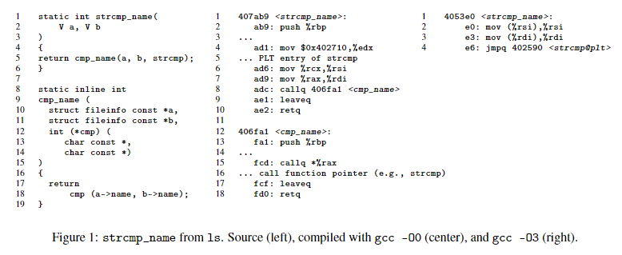
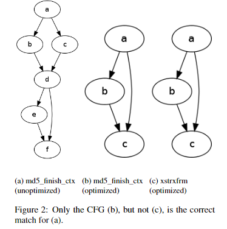
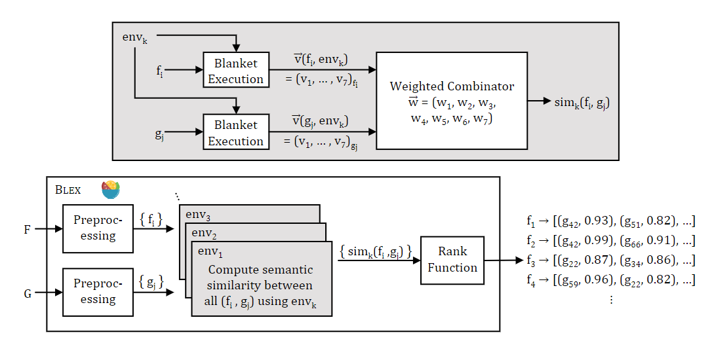
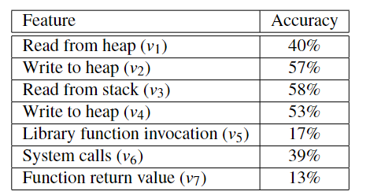

# BLEX

| Target（目标）     | 判断两个二进制函数是否语义相似                               |
| :----------------- | :----------------------------------------------------------- |
| Input（输入）      | 待比较的两个二进制函数                                       |
| Process（处理）    | 动态分析，记录函数执行过程中的特征。 特征相同的函数被判定为语义相似 |
| Output（输出）     | 两个二进制函数的相似度                                       |
| Problem（问题）    | 解决的问题： 1. 现有方法面对不同编译器/优化选项生成的二进制文件时效果不佳 2. 现有方法无法进行程序间分析 |
| Condition（条件）  | 1. 对比的二进制函数不包含debug信息 2. 二进制未被打包    |
| Difficulty（难点） | 设计动态分析方法，保证动态分析覆盖率                         |
| Level（水平）      | USENIX2014                                                   |

## 问题分析

1. 语义相似的函数在二进制程序中不一定句法相似（受编译选项影响），案例见下图

   

2. 判断两个二进制函数是否相似需要考虑程序间调用，因为部分优化选项会把函数调用优化掉（inline）

3. 不能仅考虑控制流图结构信息，案例见下图

## 算法原理

### 算法原理图

### 动态分析

#### 环境设置

环境：为所有寄存器和内存空间提前设置固定的值，一套这样的“固定值”称为一个环境

#### 动态分析

每次从函数 $f$ 的第一个未被执行的指令开始，重复进行动态分析，直到函数的所有指令都被执行。具体流程如下：

1. 指定执行环境
1. 提取函数中未被执行过的指令，构建未执行指令集
1. 选择未执行指令集中地址最低的指令开始执行，将被执行过的命令从未执行指令集删除
1. 记录执行过程中的特征信息
1. 重复3、4，直至未执行指令集为空

#### 实际实施

- 通过从程序的指定地址载入实现从任意指令开始执行
- 设置 `LD_BIND_NOW` 环境变量，使程序在开始执行前就载入所有动态链接库，避免动态载入导致无法记录函数特征
- 使用Pin框架监控动态分析结果

#### 动态分析停止时机

- 程序执行到函数尾。通过记录栈深度实现，函数调用使深度+1，返回使深度-1。当深度为0时，执行结束。
- 程序抛出异常
- 执行了指定数量的指令
- 超时

#### 记录的特征

- 从堆中读取的值
- 向堆中写入的值
- 从栈中读取的值
- 从栈中写入的值
- 通过plt表调用的函数
- 在执行过程中进行的系统调用
- 函数执行完毕后的返回值

### 语义相似度计算

使用[Jaccard相似度](../concept.md#jaccard相似度)计算特征间相似性，设 $v_i(f,env_k)$ 为函数 $f$ 在环境 $k$ 下生成的特征， $w$ 为权重，则环境 $k$ 下的语义相似度可记为

$$sim_k(f,g)=\displaystyle\sum_{i=1}^N(w_i\times \frac{|v_i(f,env_k)\cap v_i(g,env_k)|}{|v_i(f,env_k)\cup v_i(g,env_k)|})/\sum_{l=1}^Nw_l$$

最终的相似度是多个环境下相似度的平均值

$$\displaystyle sim(f,g)=\frac{1}{K}\sum_k sim_k(f,g)$$

#### 权重设计

进行7次小实验，每次仅使用7个特征中的一个特征，结果如下

使用支持向量机计算每个权重

## 笔者总结

算法特点：

- 使用动态分析应对跨架构、跨编译选项相似度分析
- 提出一种能够保证覆盖率的动态分析方法

可能存在的问题：

- 算法复杂度高，需考虑执行过程中的许多特例情况

- 匹配准确率不高，只有80左右，猜测与”环境“设计有很大关系，本文中设置的环境距离实际场景较远，且环境数量较少
