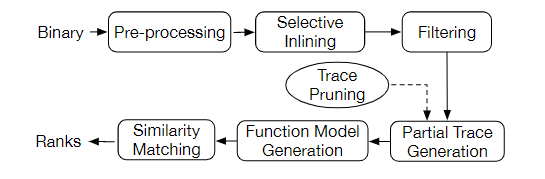
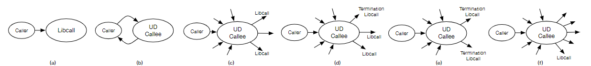
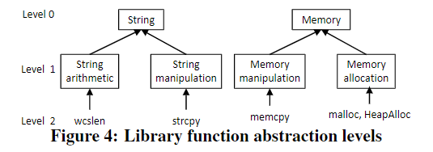

# BinGo

| Target（目标）     | 已知某个二进制函数，在其他二进制文件中检索具有与之相似的函数 |
| :----------------- | :----------------------------------------------------------- |
| Input（输入）      | 待搜索二进制代码库；已知二进制函数                           |
| Process（处理）    | 1. 函数内联：根据决策规则将部分函数的汇编代码内联 2. 函数筛选：设置规则缩小待检索范围 3. 函数匹配：提取函数片段，提取片段语义特征并以此进行函数匹配 |
| Output（输出）     | 与已知二进制函数相似的函数列表                               |
| Problem（问题）    | 需解决的问题： 1. 算法需要对于跨架构、操作系统和编译器的二进制程序鲁棒 2. 需要考虑算法的语义信息 3. 能使用于大范围搜索 |
| Condition（条件）  | 程序可被正常反编译                                           |
| Difficulty（难点） | 需内联应对编译器优化所带来的控制流图结构差异                 |
| Level（水平）      | FSE2016                                                      |

## 算法原理

### 算法原理图

### 选择性内联

#### 函数调用模式

定义了6种常见的函数调用模式，见下图

1. 直接调用库函数，需内联
2. 调用用户自定义的函数，需内联
3. 调用用户自定义函数，该函数调用了几个库函数，几乎不调用用户自定义函数。此类函数多为用户撰写的需复用的工具函数，需内联
4. 与3类似，区别在于完全不调用用户自定义函数，需内联
5. 与4类似，但是只调用终止函数（exit/abort等），此类函数主要起终止作用，语义价值较少，不内联
6. 用户自定义函数，调用大量其他自定义函数，此时认为该函数起调度器作用，语义价值较少，不内联

#### 内联决策

设置函数耦合分数（Function Coupling Score）：

$$\alpha=\lambda_e/(\lambda_e+\lambda_a)$$

其中 $\lambda_e$ 代表被调用函数调用的自定义函数数量； $\lambda_a$ 代表调用被调用函数的自定义函数数量

该值越小，说明函数越应该被内联

### 函数筛选

共设计三种筛选策略

1. 仅查找与待搜索函数调用完全相同库函数的函数。缺点是无法跨操作系统，且不支持名称不同但是功能相似的库函数
2. 在1的基础上，提取库函数的高层次语义特征（见下图），使用图中level1级特征解决1中问题。缺点是无法涵盖用户自定义的相似功能函数以及在优化过程中被编译器内联的函数。
3. 将函数抽象为具体的语义类别（如mov被分类至数据移动；push被分类至栈操作），依据语义类别进行筛选

实际筛选过程中，给三个筛选策略分类不同的权重（策略1的权重最高，3的权重最低），使用Jacarrd距离计算相似度，乘以权重后排序，提取排名靠前的用于下一步。

### 函数匹配

#### 函数片段提取

使用[Tracy](./Tracy.md)的方法提取函数片段

#### 语义特征提取

使用I/O对表示语义特征。为避免语义提取过程中忽视了变量的前后关联性，额外考虑变量的前后状态，使用Z3证明器生成I/O对。

#### 路径剪枝

- 除去无效路径（程序片段）：如果Z3证明器无法确定某个变量在执行前后的状态，则认为是无效路径
- 除去编译器优化相关路径（程序片段）：如果编译器相关指令在路径中占比过大，则剪枝

#### 相似度计算

算法不固定路径长度（函数片段的长度可为1，2，3）

使用Jaccard相似度评判两个函数的相似程度

## 笔者总结

算法特点：

- 通过主动内联应对编译器优化问题
- 增强变量的前后关联性
- 不固定路径长度（选用1，2，3长度）

可能存在的问题：

- 算法效果受制于定义证明器的性能
- 算法预处理/搜索时间较长
- 考虑借用文本领域方法替代定理证明器

