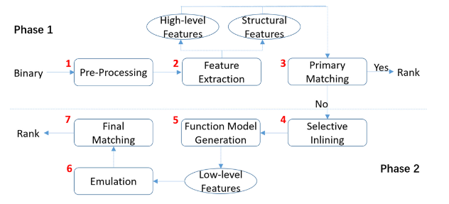
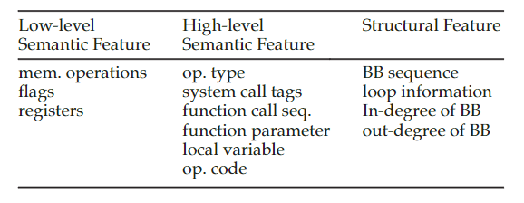
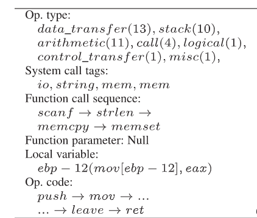

# BinGo-E

| Target（目标）     | 已知某个二进制函数，在其他二进制文件中检索具有与之相似的函数 |
| :----------------- | :----------------------------------------------------------- |
| Input（输入）      | 待搜索二进制代码库；已知二进制函数                           |
| Process（处理）    | 1. 提取高层次语义特征、结构特征进行初步筛选 2. 选择性内联函数 3. 低层次语义特征提取（模拟器） 4. 结合高层次和低层次特征进行相似性分析 |
| Output（输出）     | 与已知二进制函数相似的函数列表                               |
| Problem（问题）    | 解决的问题： 1. 使用低层次语义特征，忽视函数间语义关系 2. 基于符号执行的算法运算开销大 |
| Condition（条件）  | 程序可被正常反编译                                           |
| Difficulty（难点） | 多层次特征的综合利用                                         |
| Level（水平）      | 1区；2019                                                    |

## 算法原理

### 算法原理图

### 特征提取

#### 3D-CFG（结构特征）

为CFG中每个节点设置一个三元组 $(x,y,z)$ 其中 $x$ 代表节点在CFG中的序号； $y$ 代表节点的出度； $z$ 代表节点的循环深度

设 $e(p,q)$ 为节点 $p$ 和 $q$ 之间的边， $w_p$ 为基本块中的汇编指令数量，则某个节点的“质心” $c$ 可表示为：

$$\displaystyle c_i=\frac{\sum_{e(p,q)\in 3D-CFG}(w_pi_p+w_qi_q)}{w},where\ i\in{x,y,z}$$

$$w=\sum_{e(p,q)\in 3D-CFG}(w_p+w_q)$$

##### 加权质心

在原本 $w$ 的基础上额外考虑函数调用数量 $N$

$$w'=w+N$$

然后使用 $w'$ 重新计算 $c$

##### 质心差异度（CDD）

$$\displaystyle CDD(\overrightarrow{c_1},\overrightarrow{c_2})=\max(\frac{|c_{1x}-c_{2x}|}{c_{1x}+c_{2x}},\frac{|c_{1y}-c_{2y}|}{c_{1y}+c_{2y}},\frac{|c_{1z}-c_{2z}|}{c_{1z}+c_{2z}},\frac{|w_1-w_2|}{w_1+w_2})$$

##### 函数差异度（FDD）

质心差异度和加权质心差异度中的最大值

#### 高层次语义特征

论文中提取的高层次语义特征如图所示

- 操作码类型：给不同的操作码分类，记录每一类出现几次
- 系统调用标签：给系统调用分类，记录下调用的系统调用类型
- 系统调用顺序
- 函数输出值
- 使用的局部变量
- 操作码xu'lie

#### 低层次语义特征

提取类似[BLEX](./BLEX.md#记录的特征)中的语义特征，该特征使用模拟器分析获得

### 选择性函数内联

使用与[BinGo](./BinGo.md#选择性内联)相同的内联策略

### 相似度计算

高维语义特征：使用Jaccard相似度计算

结构特征： $1-FDD$

低维语义特征：与BinGo相同的计算方式

## 笔者总结

算法特点：

- 增加结构特征和高层次语义特征（跨架构时不使用结构特征）
- 使用模拟器替代定理证明器

可能存在的问题：

- 使用Jacarrd相似度进行相似性计算，偏向于规则判断，可能在精度上还有提升空间
- 可以考虑结合一些机器学习方法
- 低层次语义相似的要求可能略微苛刻

