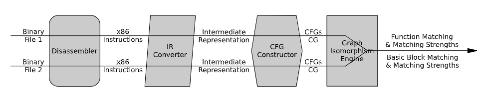

# BinHunt

| Target（目标）     | 对比分析两个二进制程序的相同/不同部分                        |
| :----------------- | :----------------------------------------------------------- |
| Input（输入）      | 待比较的两个二进制程序                                       |
| Process（处理）    | 1. 反编译，转化未中间表示 2. 提取控制流图、函数调用图 3. 计算基本块相似度，在此基础上发掘函数的最大公共子图 |
| Output（输出）     | 输入两个二进制程序的函数配对结果及对应的置信度               |
| Problem（问题）    | 解决的问题： 1. 现有方法未利用二进制语义信息            |
| Condition（条件）  | 输入的两个二进制程序确定为相似程序                           |
| Difficulty（难点） | 设计算法完成从粗粒度到细粒度的二进制差分                     |
| Level（水平）      | ICICS2008                                                    |

## 算法原理

### 算法原理图

### 基本块相似度分析

使用符号执行（定理证明器）判断两个基本块涉及的寄存器和变量的数值在执行完毕后是否一致

### 函数相似度分析

在完成基本块相似度分析的条件下，发掘函数的最大公共子图