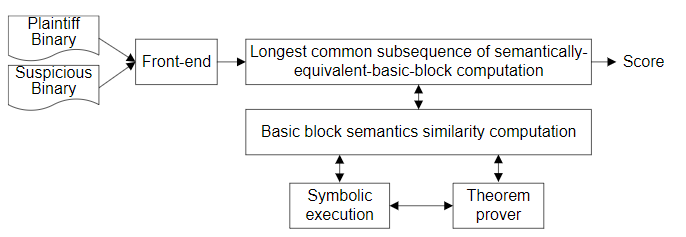

# CoP

| Target（目标）     | 判断程序之间是否存在抄袭行为                                 |
| :----------------- | :----------------------------------------------------------- |
| Input（输入）      | 待比较的两个二进制程序                                       |
| Process（处理）    | 1. 利用定理证明器完成基本块级相似度比较 2. 从源函数提取代码片段 3. 利用最长公共子序列算法计算目标函数和各代码片段的相似度（公共子序列长度） 4. 加权平均得到整体代码相似度 |
| Output（输出）     | 二进制相似度得分                                             |
| Problem（问题）    | 现有方法无法应对基本块合并/缺失等问题                        |
| Condition（条件）  | 单一架构；一对一分析                                         |
| Difficulty（难点） | 设计弱控制流图路径依赖的代码片段匹配算法                     |
| Level（水平）      | FSE2014                                                      |

## 算法原理

### 算法原理图

### 基本块级相似度比较

基本块等价的定义：

两个基本块中输入数量较少的那一个可以在另一个基本块中找到与之等价的输入输出

通过定理证明器完成比较。

### 路径相似度比较

1. 首先从输入程序中提取代码片段（路径）
2. 使用最长公共子序列算法计算目标程序与该代码片段的相似度（该算法支持应对基本块的缺失、增加等）

回溯处理：如果输入函数中存在连续的基本块没法匹配，则将其合并为一个重新尝试匹配。部分解决基本块切分/合并带来的问题

### 函数级相似度计算

根据代码片段长度为该代码片段的相似度加权（越长权值越大），计算平均路径相似度

