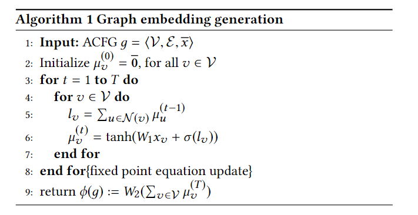
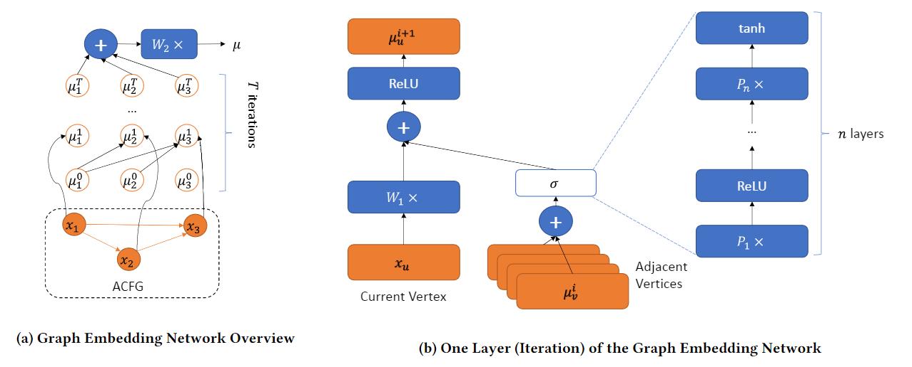
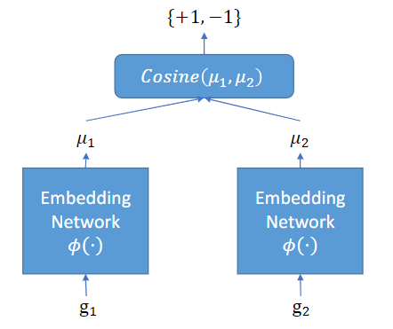

# Gemini

| Target（目标）     | 已知某个bug，在其他二进制文件中检索具有相同问题的函数        |
| :----------------- | :----------------------------------------------------------- |
| Input（输入）      | 二进制程序（函数级）                                         |
| Process（处理）    | 1. 利用改进后的structure2vec方法完成图嵌入 2. 使用孪生网络训练嵌入模型 3. 依据嵌入向量完成相似度计算 |
| Output（输出）     | 与输入函数相近的函数的列表                                   |
| Problem（问题）    | 解决的问题： 1. 现有算法嵌入过程效率低（“密码本”生成依赖图匹配算法） 2. 运行开销与“密码本”大小正相关，而小的“密码本”难以保证算法精度 |
| Condition（条件）  | 需做区分的程序在控制流图上需有明显差异                       |
| Difficulty（难点） | 使用合适的嵌入方法替代二分图匹配过程                         |
| Level（水平）      | CCS2017                                                      |

## 算法原理

### 图嵌入网络

在Structure2vec的基础上进行优化改造而成

#### 基本Structure2vec方法

其核心是一个嵌套的运算过程，设图 $g$ 的节点 $v$ 的特征向量为 $x_v$ ，邻居节点为 $\mathcal{N}(v)$ ，则嵌套运算过程可表示为：

$$\mu_v^{(t+1)}=\mathcal{F}(x_v,\displaystyle\sum_{u\in \mathcal{N}(v)}\mu_u^{(t)}), \forall v\in \mathcal{V}$$

 其中， $\mu_{v}^{(0)}$ 为全0向量， $\mathcal{F}$ 为一个非线性映射函数。嵌套过程按照拓扑关系进行，某个节点的特征向量会在嵌套过程中不断向后传播

非线性映射函数的各项参数通过学习获得

#### 本文修改后的方法

本文使用神经网络替代公式中的 $\mathcal{F}$ ：

$$\mathcal{F}(x_v,\displaystyle\sum_{u\in \mathcal{N}(v)}\mu_u^{(t)})=\tanh(W_1x_v+\sigma(\displaystyle\sum_{u\in \mathcal{N}(v)}\mu_u))$$

其中 $\sigma$ 是非线性转移函数，论文使用一个n层的全连接替代：

$$\sigma(l)=\underbrace{P_1\times \mathrm{ReLU}(P_2\times \cdots\mathrm{ReLU}(P_n l))}_{n\ \mathrm{levels}}$$

#### 默认超参数

嵌入向量大小 $p=64$ ，嵌入深度 $n=2$ ，嵌套次数 $T=5$ 

ACFG的特征在[Genius](./Genius.md)的基础上删除了介数中心性特征。

### 使用孪生网络训练网络参数

孪生网络的网络结构如下图所示，图中两个嵌入网络结构相同，共享参数。孪生网络输出为两个嵌入网络输出的余弦距离。

当输入的两个样本为使用同一段代码在不同条件下编译而来时，标签为+1；否则标签为-1。

该模型支持预训练（使用上述策略）和重训练（可适当修改标签计算方式）

## 笔者总结

算法特点：

- 使用神经网络替代传统图匹配算法进行嵌入
- 利用孪生神经网络进行训练，解决相似度分析任务标签问题
- 支持模型预训练和重训练

可能存在的问题：

- 无法区分控制流图结构上相似的函数（如补丁前和补丁后）
- 图嵌入依赖提取的特征进行嵌入，并非真正意义上的“端到端”
- 弱化图连接/结构特征

