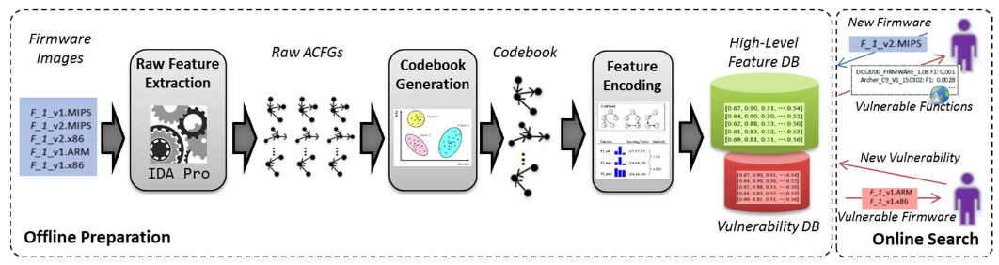
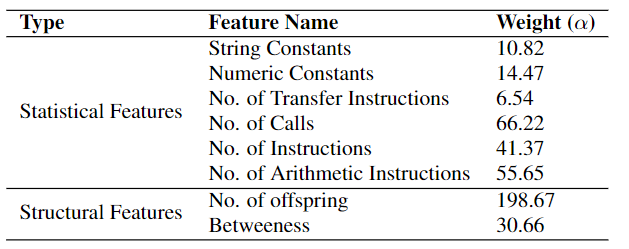

# Genius——<u>G</u>raph <u>En</u>coding for B<u>u</u>g <u>S</u>earch

| Target（目标）     | 已知某个bug，在其他物联网固件中检索具有相同问题的固件        |
| :----------------- | :----------------------------------------------------------- |
| Input（输入）      |                                                              |
| Process（处理）    | 1. 特征提取：从二进制中提取属性控制流图（ACFG） 2. “密码本”生成：使用聚类算法学习ACFG中的高维类别特征 3. 特征编码：利用高维类别特征完成ACFG在高维空间中的编码 4. 在线搜索：使用局部敏感哈希对编码后的特征进行搜索 |
| Output（输出）     |                                                              |
| Problem（问题）    | 应用问题：现有方法                                           |
| Condition（条件）  |                                                              |
| Difficulty（难点） |                                                              |
| Level（水平）      | CCS2016                                                      |

## 算法原理

### 算法原理图

### 特征提取

#### 属性控制流图（Attributed Control Flow Graph）

一个有向图 $G=\langle V,E,\phi \rangle$ ，其中 $V$ 是基本块集合， $E\subseteq V \times V$ 表示基本块之间边的集合， $\phi : V\rightarrow \sum$ 为基本块到属性集合的映射函数。

#### ACFG生成方法

在CFG的基础上添加每个基本块的属性特征，属性特征由统计特征和结构特征两部分组成，特征列表如下表所示。

部分特征说明：

- No. of offspring：控制流图中该节点的子节点个数
- Betweeness：节点的[介数中心性](../concept.md#介数中心性)

### “密码本”生成

“密码本”（codebook）是一个有限离散集合，其中每个元素均为一个聚类中心。

#### ACFG相似度计算

本文使用“[二分图](../concept.md#二分图)匹配"方法计算两个ACFG之间的相似度
