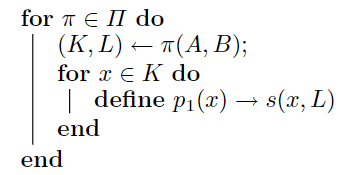
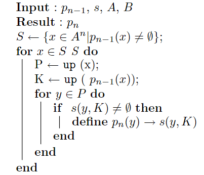

# Graph-based comparison of executable objects

| Target（目标）     | 对比分析两个二进制程序的相同/不同部分                        |
| :----------------- | :----------------------------------------------------------- |
| Input（输入）      | 待比较的两个二进制程序                                       |
| Process（处理）    | 1. 将程序看作多级有向图 2.  从程序级开始，不断寻找图中能够匹配的匹配点（fixedpoints），并对匹配点进行扩展 3. 当无法再扩展时，细化进入函数级 4. 使用相同的方法寻找匹配点并扩展，随后细化进入基本块级重复操作 |
| Output（输出）     | 两个二进制程序的相同/不同部分                                |
| Problem（问题）    | 解决的问题： 1. 尚未有较为成熟的二进制程序差分算法      |
| Condition（条件）  | 输入的两个二进制程序确定为相似程序                           |
| Difficulty（难点） | 设计算法完成从粗粒度到细粒度的二进制差分                     |
| Level（水平）      | SSTIC2005                                                    |

## 基本概念

### 二进制文件之间的差异

同一源代码编译后的二进制文件之间的差异可能体现在：

- 调用了不同的寄存器
- 指令顺序出现变化
- 分支的判断条件发生调转（后续分支也对应调转）

### 有向图的有向图（graph of graphs）

将一个程序看作一个有向图（函数调用图，call graph）；其中图的每个节点代表一个函数，又是一个有向图（函数的控制流图）；控制流图中的每个基本块也可看作一个图结构（指令图）。

## 算法原理

### 基本思路

1. 从程序级开始，不断寻找图中能够匹配的匹配点（fixedpoints），并对匹配点进行扩展
2. 当无法再扩展时，细化进入函数级
3. 使用相同的方法寻找匹配点并扩展，随后细化进入基本块级重复操作

### 选择器

选择器 $s$ 的输入为一个节点和另一个图中的一组节点，输出为后者中的一个节点或空集

$$\displaystyle s:A^n\times \mathfrak{B}(B^n)\rightarrow B^n\cup\varnothing$$

上式中， $\mathfrak{B}$ 表示[幂集](../concept.md#幂集（power-set）) 。选择器的任务是从一组节点中选出与输入节点最相似的节点。

#### 论文中使用的选择器

- 函数调用图（节点为函数）
  - 函数中包含的基本块数量
  - CFG中边的数量
  - 子函数调用数量
  - 将上述三个特征合成为向量，计算欧氏距离
- CFG（节点为基本块）
  - 到函数出口的最短距离
  - 到函数入口的最短距离
  - 基本块中的子函数调用数量
- 基本块级
  - 到函数出口的最短距离
  - 到函数入口的最短距离

### 属性

定义为两个图 $A$ 和 $B$ 到他们节点子集的映射

$$\pi(A,B)\rightarrow(A'^n,B'^n)$$

其作用主要是降低搜索空间的大小

#### 论文中选取的属性

- 通用属性
  - 选择入度/出度为k的节点
  - 选择循环节点（节点存在指向自己的环路）
- 函数调用图属性
  - 相同函数名称
  - 使用了相同的字符串
  - 含有相同的“小素数积”（见下文）
- CFG属性
  - 包含相同的子函数调用

### 同构图获取

1. 从 $\pi(A,B)$ 中选取起始点（见下图1）
2. 从已匹配点的父/子节点中寻找匹配点（见下图2）

### 兼容指令序列变化

指令顺序的变化可以等价为下述问题：

假设存在两个等长的单词 $a、b$ ，需要判断是否存在一个排列 $\sigma$ ，使 $\sigma(a)=b$ 

解决方案：使用“小素数积”算法。

令 $P_m:=\{3,\dots,\rho_m\}$ 为前m个奇素数，m为构成单词的字母表长度。

构造字母到奇素数的一对一映射 $\tau$ ，计算构成单词的各字母映射后的积

$$\displaystyle \prod_{i=1}^n\tau(a_i)=\prod_{i=1}^n\tau(b_i)$$

若相同则认为存在 $\sigma(a)=b$ 

当n较大时，算法计算复杂度较高，论文对该方面做出了优化，此处不再展开

