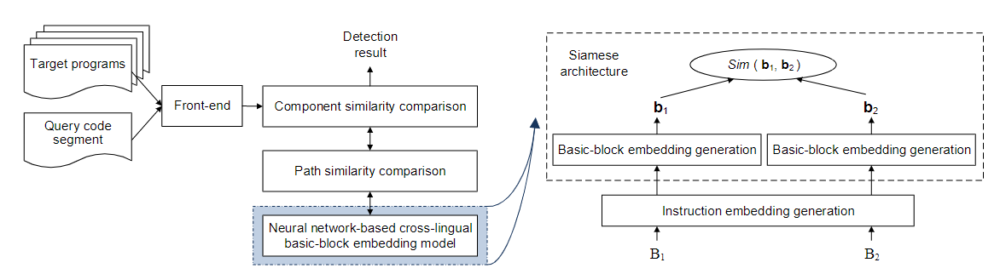
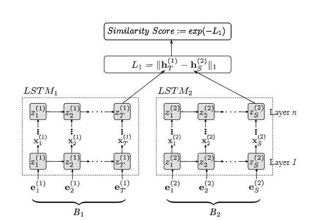

# InnerEye

| Target（目标）     | 1. 判断二进制语义相似度 2. 判断代码片段是否被包含在另一程序中 |
| :----------------- | :----------------------------------------------------------- |
| Input（输入）      | 被查询的二进制代码序列；待搜索二进制库                       |
| Process（处理）    | 1. 单一架构指令嵌入 2. 利用LSTM生成基本块级的嵌入向量 3. 最大公共子序列算法评判相似度 |
| Output（输出）     | 二进制相似度值                                               |
| Problem（问题）    | 1. 人工选择的特征导致指令间关系的信息损失 2. 不支持比函数级更细粒度的相似性分析 |
| Condition（条件）  | 需要包含基本块级相似度的数据集                               |
| Difficulty（难点） | 1. 提取二进制程序间的语义信息 2. 实现跨架构语义间的对比 |
| Level（水平）      | NDSS2019                                                     |

## 算法原理

### 算法原理图

### 指令嵌入

#### word2vec 

使用滑动窗口分析整个句子，最大化如下概率：

$$\displaystyle J(w)=\frac{1}{T}\sum_{t=1}^{T}\sum_{w_k\in C_t}(\log P(w_k|w_t))$$

其中：

$$\displaystyle P(w_k\in C_t|w_t)=\frac{\exp(\mathbf{w}_t^T\mathbf{w}_k)}{\sum_{w_i\in C_t}\exp(\mathbf{w}_t^T\mathbf{w}_i)}$$

即希望建立嵌入向量与上下文的关系

#### 数据集建立

在训练前需要解决OOV（out of vocabulary）问题，因此提前对汇编代码做处理：

- 数值常量替代为0，保留正负号
- 字符串替换为`<STR>`
- 函数名称被替换为 FOO
- 其他符号常量被替换为 `<TAG>`

#### 嵌入模型训练

为每个架构的汇编代码训练一个嵌入模型

### 基本块嵌入向量生成

使用孪生网络结构是的不同架构下相似的”句子“在经过LSTM提取特征后相似。

**需要基本块级的训练数据**

### 代码片段相似度比较

首先从控制流图中提取代码片段，计算最大公共子序列（LCS）作为相似度值

设 $\Gamma=\{\mathcal{P}_1^t,\dots,\mathcal{P}_i^t\}$ 是目标程序 $T$ 中提取的代码片段，相似度可写为：

$$\displaystyle\psi(P,T)=\frac{\max_{\mathcal{P}\in \Gamma}|\mathrm{LCS}(\mathcal{P},\mathcal{P_i^t})|}{|\mathcal{P}|}$$

## 笔者总结

算法特色：

- 使用word2vec提取指令嵌入用于相似度分析
- 指令替换，避免OOV问题
- 算法效率大大提升

可能存在的问题：

- 独立生成跨架构分析模型，可能存在跨架构精度不足的问题
- 使用孪生网络“强行”使不同的嵌入表示可比
- 还需思考语句嵌入方法下如何更好解决跨架构问题（中间表示？）