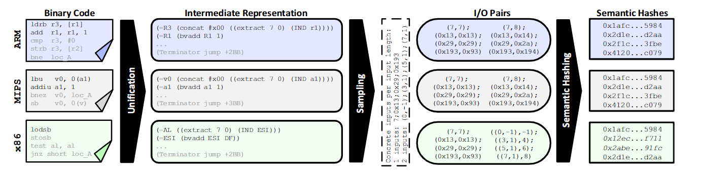
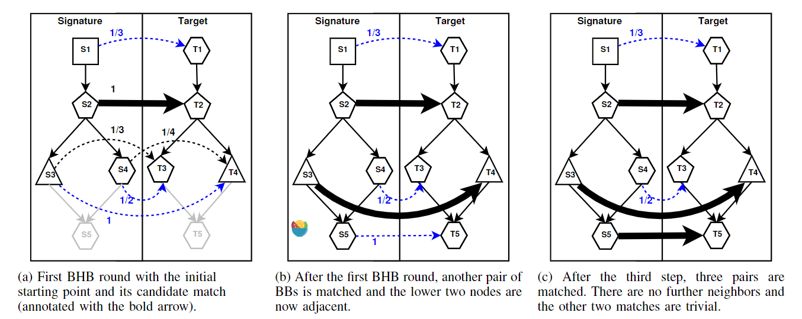

# Multi-MH

| Target（目标）     | 已知某个bug，在其他二进制文件中检索具有相同问题的函数        |
| :----------------- | :----------------------------------------------------------- |
| Input（输入）      | 二进制程序（基本块级）                                       |
| Process（处理）    | 1. 获取bug函数的指纹 2. 将bug函数的指纹与目标程序都转化为中间表示 3. 构造基本块级的语义哈希 4. 结合控制流图，使用最佳匹配扩展算法进行相似度计算 |
| Output（输出）     | 与已知漏洞所在函数相近的函数                                 |
| Problem（问题）    | 解决的问题： 1. 依赖源代码进行bug搜索 2. 仅能支持单一架构下的搜索【重点】 3. 依赖动态调试 |
| Condition（条件）  | 1. 算法在使用专家优化后的二进制片段（基本块+块间连接）时有最优效果 2. 编译器在编译时未使用多种不同的优化策略 |
| Difficulty（难点） | 寻找支持跨架构分析的特征表示手段                             |
| Level（水平）      | S&P2015                                                      |

## 算法原理

### 算法原理图

### bug指纹

人工选择与待查询bug强相关的二进制片段作为bug指纹

### 构建中间表示

- 使用VEX（pyvex）提取中间表示
- 将中间表示输入“Z3”定理证明器，获取可用于输入输出计算的S-Expressions

### 采样获取语义特征

随机生成向量，向量各元素的取值范围为 $[-1000,1000]$ 

将输入长度、输入、输出组合，生成64位的CRC校验值作为输入输出对的表示

只用拥有相同输入长度的基本块之间才具有可比性

#### 优化方案

-  $a:=b-c$ 与 $a:=c-b$ 之间应当是相似的，但是在输入相同时得到的结果完全相反。为解决这一问题，在构造输入时同时构造置换顺序后的输入。

  例：输入 $(b=1,c=2)$ 和 $(b=3,c=5)$ 时两个式子的输出分别为 $(-1,-2)$ 和 $(1,2)$ 。增加置换后的输入 $(b=2,c=1),(b=5,c=3)$ 后输出变为 $(-1,-2,1,2)$ 和 $(1,2,-1,-2)$ ，具有一定的相似性

- 当输入为内存中的值时，默认需要两个输入：内存地址和地址中的值。由于不同架构下的寄存器数量不同，可能导致输入数量不同（a架构使用寄存器作为输入，b架构使用内存中的值作为输入）。为解决这一问题，方法统一将内存中的值处理为单一输入

### 语义哈希

论文使用[MinHash](../concept.md#MinHash)对输入输出对的CRC校验值进行语义哈希。MinHash中使用的哈希变换函数为仿射哈希变换：

$$h(x)=ax+b\  \mathrm{mod} \ p$$ 

为了进一步优化MinHash效果，对上述函数的结果做轮转和异或变换，使得MinHash选中的CRC校验值更倾向于随机：

$$t(h(x))=rotate(h(x),a)\oplus b$$

#### 优化方案

- 为每个基本块计算按照不同的输入变量个数计算多次MinHash，两个基本块之间的相似度计算公式如下：

  $$\frac{\sum_is_i\cdot(\omega_i+\omega_i')}{\sum_i(\omega_i+\omega_i')}$$

  其中 $s_i$ 是输入变量个数为 $i$ 时的相似度， $\omega_i$ 和 $\omega_i'$ 分别为两个基本块中的式子数。解决方法在式子数较少的基本块上的偏差

- 保存每个哈希函数计算后的 $k$ 个最小哈希值，以考虑一个基本块有多个相同匹配的情况，在本文中取 $k=3$

### bug指纹匹配

使用最佳匹配扩展（Best-Hit-Broadening）算法进行指纹匹配，算法流程：

1. 在bug签名中选择起始点，输入起始点在上一步骤中获得的相似基本块列表
2. 选择列表中的一个，将起始点与该基本块设置为已匹配
3. 根据CFG，分析已匹配基本块的直接前驱和直接后继，寻找每个基本块在搜索空间中的相似基本块，并计算其相似度
4. 选择一个相似度最高的基本块对设置为已匹配
5. 重复3-4，直至所有基本块都匹配完成
6. 计算bug指纹与匹配后的基本块序列的相似度
7. 重复2-6，直至基本块列表中的所有元素均计算完成

经实验研究，论文将最初的相似基本块列表设置为200

## 笔者总结

算法特点：

- 首次提出跨架构的二进制搜索方法，利用中间表示作为过渡
- 可以进行基本块粒度的搜索
- 使用输入输出对提取了二进制语义信息

可能存在的问题：

- 认为控制流图在跨架构编译后基本不变，基本不考虑不同编译选项对于控制流图结构的影响，对于不同编译选项的鲁棒性不佳

- 语法特征的采样过程需考虑覆盖率问题，当前覆盖率存疑

- 可扩展性较弱，对于一种新语言的支持需要人工设计汇编-中间表示的规则。如当前不支持x64
- 在进行较大函数的匹配时可能会出错
- 【？】方法对于控制流图的结构十分敏感
- 目前无法区分未修复/已修复的漏洞
