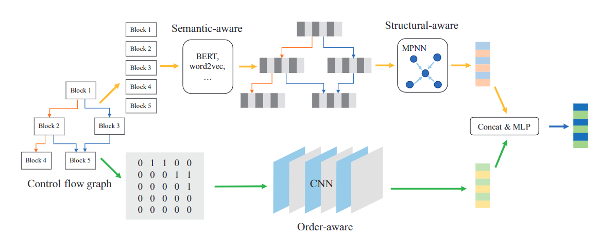
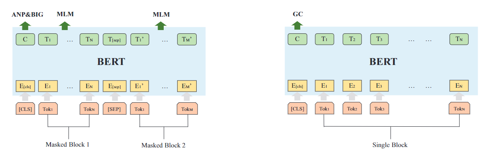

# Order Matters: Semantic-Aware Neural Networks for Binary Code Similarity Detection

| Target（目标）     | 函数级二进制相似度分析                                       |
| :----------------- | :----------------------------------------------------------- |
| Input（输入）      | 二进制函数的控制流图                                         |
| Process（处理）    | 1. 使用BERT进行基本块语义建模 2. MPNN对BERT的输出进一步做嵌入，获取整个函数的嵌入 3. 提取邻接矩阵，使用CNN提取特征，与2中的特征合并用于相似度分析 |
| Output（输出）     | 相似度分值                                                   |
| Problem（问题）    | 解决的问题： 1. 未利用节点顺序信息 2. 获取相似基本块需要依靠专家经验 |
| Condition（条件）  | 程序可被正常反编译                                           |
| Difficulty（难点） | 节点顺序信息和结构信息的提取                                 |
| Level（水平）      | AAAI2020                                                     |

## 算法原理

### 算法原理图

### 语义特征建模

使用4任务bert提取语义信息，详细结构如下；

MLM：Masked language model，提取基本块内的语义信息。在输入层掩盖某个token，尝试在输出层进行预测

ANP：Adjacency node prediction，提取图中所有的相邻的基本块，预测随机采样的两个基本块是否相邻

BIG：Block inside graph，让模型判断两个节点是否同时存在于同一个图中

GC：Graph classification，分类不同平台、架构、优化选项下的图

### 结构特征建模

使用MPNN对BERT的输出进一步做嵌入，获取整个函数的嵌入

### 基本块顺序建模

提取邻接矩阵，使用CNN提取特征

除最后一层外，CNN不使用池化层，确保对于连接信息的提取

### 笔者总结

算法特色：

- 综合考虑多方面信息
- 使用CNN分析邻接矩阵，提取连接信息

可能存在的问题：

- CNN如何处理输入大小不一致问题？是否会导致对于基本块数量较多的函数分类效果较差？
- 