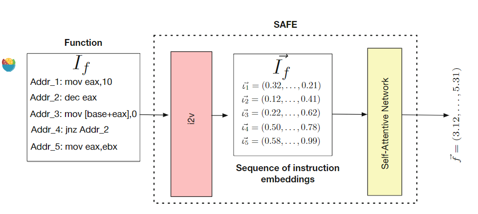
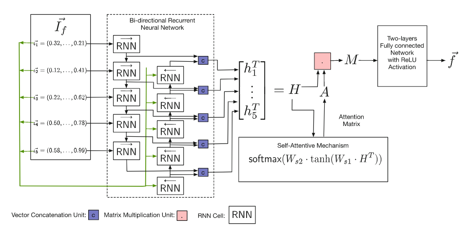

# SAFE

| Target（目标）     | 已知某个二进制函数，在其他二进制文件中检索具有与之相似的函数 |
| :----------------- | :----------------------------------------------------------- |
| Input（输入）      | 二进制程序（函数级）                                         |
| Process（处理）    | 1. 使用word2vec构造汇编指令嵌入 2. 带注意力机制的双向RNN实现函数嵌入 3. 利用函数嵌入实现相似度匹配 |
| Output（输出）     | 与输入函数相近的函数的列表                                   |
| Problem（问题）    | 解决问题： 1. 先前方法使用人工选择的特征进行嵌入，特征向量存在偏差 2. 先前方法特征提取速度慢 |
| Condition（条件）  | 使用不同模型处理单一架构/跨架构任务                          |
| Difficulty（难点） | 嵌入向量的端到端提取                                         |
| Level（水平）      | DIMVA2019                                                    |

## 算法原理

### 算法原理图

### 汇编指令嵌入（i2v）

预处理：将汇编指令中所有内存都替换为MEM；将大于5000的立即数都替换为5000

使用 word2vec 进行嵌入

### 函数嵌入

将指令嵌入输入带注意力机制的双向RNN，提取函数嵌入

使用孪生网络进行训练

