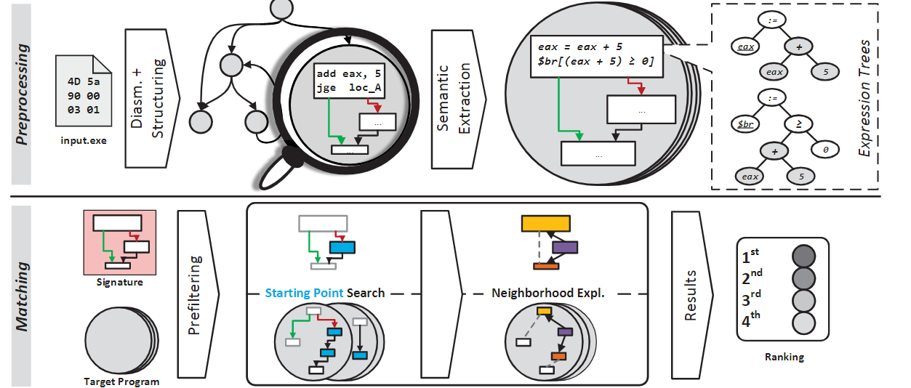

# TEDEM——Tree Edit Distance based Equational Matching

| Target（目标）     | 已知某个bug，在其他二进制文件中检索具有相同问题的代码片段    |
| :----------------- | :----------------------------------------------------------- |
| Input（输入）      | 二进制程序（分析粒度为基本块级）                             |
| Process（处理）    | 1. 预处理：反编译二进制程序，提取表达式树 2. 使用基本块的统计特征进行初步筛选 3. 使用树编辑距离对初筛结果进行相似度分析 4. 使用贪婪算法对bug指纹（CFG）进行匹配 |
| Output（输出）     | 与输入函数相近的函数的列表                                   |
| Problem（问题）    | 解决的问题： 1. 仅基于结构的相似度分析方法无法区分结构相似，语义不同的二进制代码 2. 函数级的搜索方法在处理较小的代码片段时效果较差 |
| Condition（条件）  | 1. 程序未被混淆 2. 搜索空间仅包含单一架构下的二进制程序 |
| Difficulty（难点） | 提取二进制代码的语义信息并做相似度比较                       |
| Level（水平）      | ACSAC2014                                                    |

## 算法原理

### 算法原理图

### 语义提取

将基本块的指令序列转化为符号式，不考虑式子变量之间的前后联系。

- 使用[METASM](https://link.springer.com/article/10.1007/s11416-009-0126-4)（此处提供论文链接，不详细展开）的方法提取中间表示，并对中间表示进行化简
- 将符号式转化为[S-expression](../concept.md#s-expression)格式，方便后续利用树结构进行分析处理

### bug指纹匹配

bug指纹定义为存在漏洞函数CFG的一部分，仅包含漏洞的关键特征。

#### 基本块相似度比较

将符号式转化为树结构，其中，根节点为赋值或跳转；叶子节点为寄存器或内存地址；中间节点为运算符。

使用树编辑距离判别符号式之间的相似程度

#### 候选项筛选/搜索

1. 在bug指纹中选择具有典型特征的基本块（统计特征与其他基本块重合的概率小于 $t$ ）作为搜索起始点
2. 使用粗粒度统计特征（符号式数量、树的深度、树的节点数量等）进行初步筛选
3. 论文设定 $t=5\%$ , 候选基本块数量（用于下一步）为20

#### 邻居节点扩展

利用CFG，使用与[Multi-MH](./Multi-MH.md#bug指纹匹配)基本相同的贪婪算法进行邻居节点扩展，此处不再重复记录。

## 笔者总结

算法特点

- 将基本块转化为树结构进行相似度计算
- 考虑了二进制程序的语义信息

可能存在的问题

- 无法处理误报，即当搜索空间中没有相似的指纹时，依然会输出匹配结果（不会显示“没有匹配项”）
- 算法时间复杂度高
- 要求匹配项的控制流图基本完全相同

