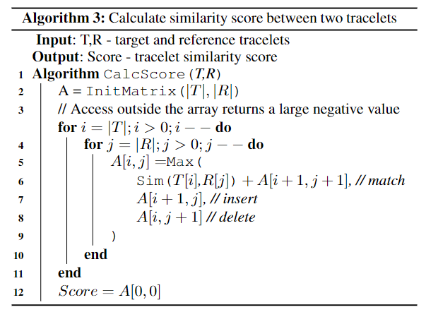
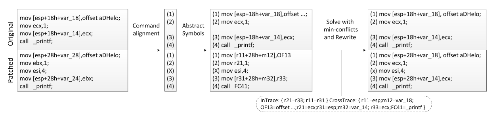

# Tracy

| Target（目标）     | 已知某个二进制函数，在其他二进制文件中检索具有与之相似的函数 |
| :----------------- | :----------------------------------------------------------- |
| Input（输入）      | 待搜索二进制代码库；已知二进制函数                           |
| Process（处理）    | 1. 将二进制程序分解为片段 2. 使用重写规则判断片段之间的距离 |
| Output（输出）     | 与已知二进制函数相似的函数列表                               |
| Problem（问题）    | 尚未有较为成熟的二进制搜索算法 |
| Condition（条件）  | 1. 程序未被混淆 2. 需要部分debug信息 3. 要求被分析的函数至少有100个基本块 |
| Difficulty（难点） | 评判二进制程序片段的相似度 |
| Level（水平）      | PLDI2014                                                     |

## 算法原理

### 预处理

- 使用被调用函数的名称替换被调用函数的偏移地址
- 使用全局变量的具体值替代全局变量的起始地址
- 使用导入表中的变量名替代变量偏移量

### 将二进制程序分解为片段

从程序控制流图中，提取连续的k个基本块作为片段（提取全部能够拆分出的片段）

提取片段的汇编指令，删除其中的跳转（因为在提取过程中已经指定了），作为片段之间距离计算的输入

### 计算二进制片段之间的距离

使用编辑距离评估片段相似度，将距离计算问题转化为重写问题，即计算需要花费多少代价才能从片段一修改为片段二

#### 指令对齐

使用“最长公共子序列”算法完成相似指令的对齐，详见下一小节。

#### 相似度计算

$$sim(c,c')=\begin{cases}2+|\{i|args(c)[i]=args)(c')[i]\}|\ SameKind(c,c')\\-1\ otherwise\end{cases}$$

相似度计算伪代码如下图所示

该算法可以得到三类结果：

- 匹配指令的集合（实现指令对齐）
- 两个片段的相似度
- 增加/删除的指令

#### 相似度值归一化

包含两种归一化方法：

containment： $S/min(RIdent,TIdent)$

ratio： $(S*2)/(RIdent+TIdent)$ 

### 使用重写引擎进一步提升效果

将目标片段中的寄存器、偏移地址等使用变量替代（上图中中间部分）

使用solver尝试对代码片段进一步匹配

匹配完毕后重新计算相似度分数

