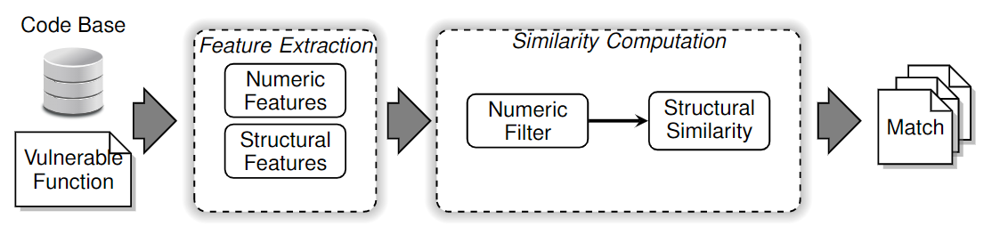
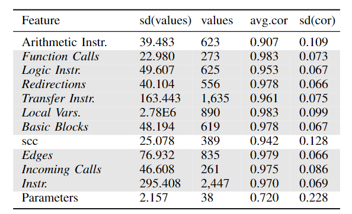
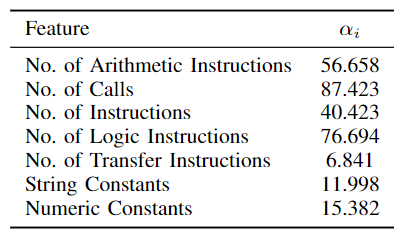
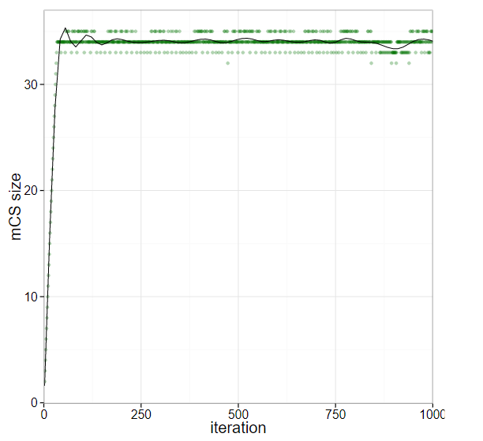
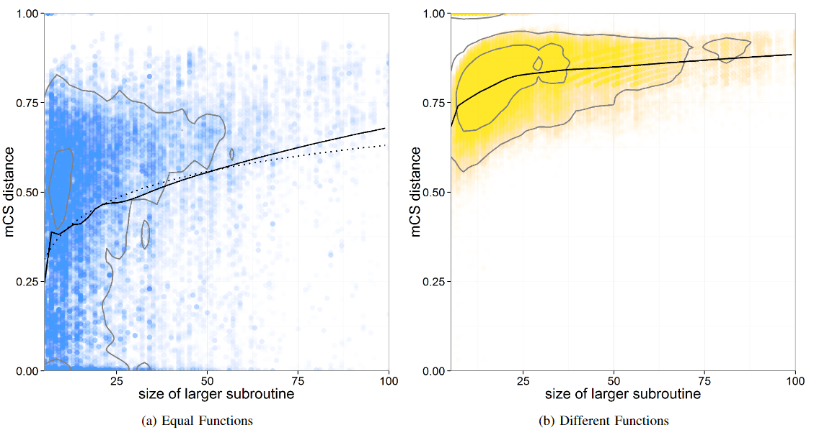

# discovRE

| Target（目标）     | 已知某个bug，在其他二进制文件中检索具有相同问题的函数        |
| :----------------- | :----------------------------------------------------------- |
| Input（输入）      | 待搜索二进制代码库；已知漏洞（bug）                         |
| Process（处理）    | 1. 提取算法统计特征，使用knn进行初步筛选 2. 通过求解最大公共子图计算两个控制流图之间的相似度 |
| Output（输出）     | 与已知漏洞所在函数相近的函数 |
| Problem（问题）    | 解决的问题： 1. 现有方法的搜索条件较为苛刻，不支持跨架构搜索 2. 搜索效率低 |
| Condition（条件）  | 1. 程序可被正常反编译 2. 程序编译过程中未使用函数嵌入（function inlining） |
| Difficulty（难点） | 1. 自行构建数据集 2. 分析数据，提出trick进一步优化准确率/搜索速度 |
| Level（水平）      | NDSS2016                                                     |

## 算法原理

### 算法原理图

### 数据准备

选择7个开源项目，在不同平台（Windows、Linux），不同架构（x86、x64、ARM），不同编译器（GCC、CL、ICC、VC），不同编译器优化选项下进行编译。

优化选项中排除了函数嵌入（function inlining），即取消部分小型函数的函数调用，直接将函数的并入上级函数中。

数据集中剔除了编译选项不同，但是编译结果相同的重复项；剔除了统计和结构特征完全相同的重复函数。

### 统计特征选择

基本思想：使用一组统计特征来描述一个二进制程序。

统计特征基本要求：1. 该值在不容编译器/编译选项下应当基本保持不变；2. 该值应当在一个较大的范围内分布

下图中灰色部分为算法中使用的统计特征

### 统计相似度分析

首先根据统计特征对二进制函数相似性做初步筛选

- 在进行筛选前对统计特征进行标准化
- 使用knn（k-d树版本）对候选函数进行初筛

### 结构相似度分析

#### 块属性特征

在提取的控制流图基础上为每个节点（基本块）添加属性特征，使用求解最大公共子图（maximum common subgraph，MCS）的方法计算相似度。

添加的属性信息如下图所示，定义属性间差异 $d_{BB}$ ，其中 $c_{if}$ 表示函数 $f$ 的第 $i$ 个属性特征：

$$d_{BB}=\frac{\sum \alpha_i |c_{if}-c_{ig}|}{\sum \alpha_i \max(c_{if},c_{ig})}$$

各属性权重的确定源自下述优化问题：

$$\max (d_{BB}(f_i,g_j)-d_{BB}(f_i,f_j)$$

即不同块之间的差异尽可能大，相同块（同一代码在不同编译器下的编译结果）之间的差异尽可能小

论文使用遗传算法求解该问题

#### 距离计算

传统的MCS距离计算方法可表示为：

$$d_{mcs.orig}(G_1,G_2)s=1-\frac{|mcs(G_1,G_2)|}{\max(|G_1|,|G_2|)}$$

论文方法在此基础上增加了属性特征损失项：

$$d_{mcs}(G_1,G_2)s=1-\frac{|mcs(G_1,G_2)|-\sum d_{BB}(b_i,b_j)}{\max(|G_1|,|G_2|)}$$

求解最大公共子图的问题是一个NP完全问题，为节约时间开销，有必要在一定时间后终止计算，使用当前近似解替代最终结果。下图为求解最大公共子图的迭代次数与获得结果之间的关系。

经作者研究，使用 $16\max (|G_1|,|G_2|)$ 次迭代后的近似解，与经过10000次迭代后的最终结果有99.11%的概率相同，因此可提前结束迭代节约时间。

此外，控制流图的大小将直接影响MCS距离（见下图），作者发现相同函数的平均MCS距离与控制流图大小的关系近似为指数关系（左图中实线为实际拟合的关系曲线，虚线为使用指数函数拟合的关系曲线）。为了弥补控制流图大小带来的相似度差异，进一步修改距离计算方法：

$$d_{mcs\_comp}(G_1,G_2)=\frac{d_{mcs}(G_1,G_2)}{comp(G_1,G_2)}$$

$$comp(G_1,G_2)=i+k\log(\max(|G_1|,|G_2|))$$

## 笔者总结

算法特点：

- 研究并使用了许多小trick以提高准确率/搜索速度
- 利用统计特征进行初筛，结构特征进行精确查找

可能存在的问题：

- 将控制流图直接作为跨架构二进制相似度分析的中间表示，实际上同一程序在不同架构下的控制流图是有部分差异的
- 各基本块特征的权重可能为具体某一数据集下的最优结果，泛化性有待考量
- 无法应对混淆
